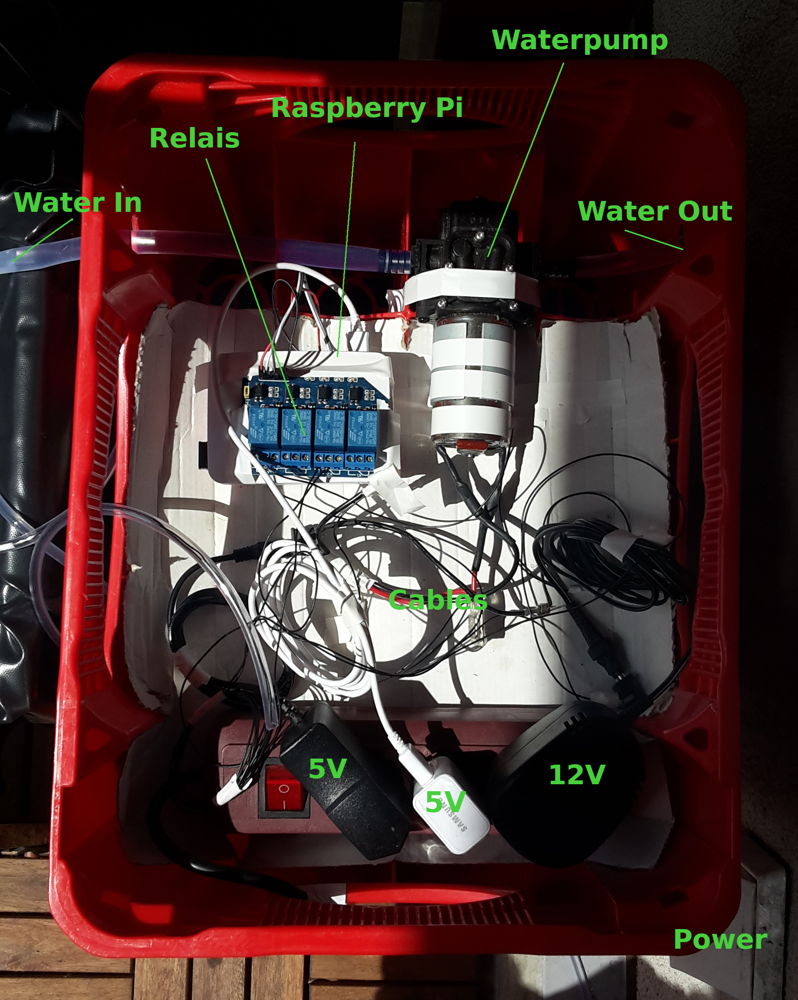
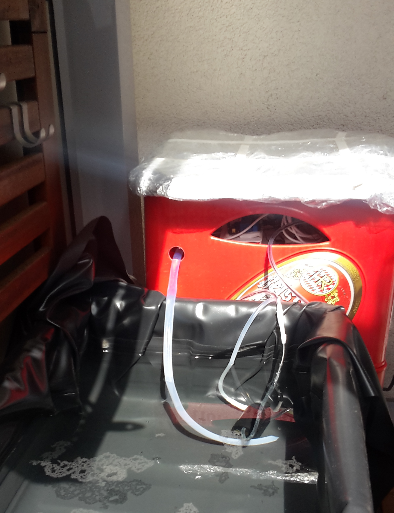
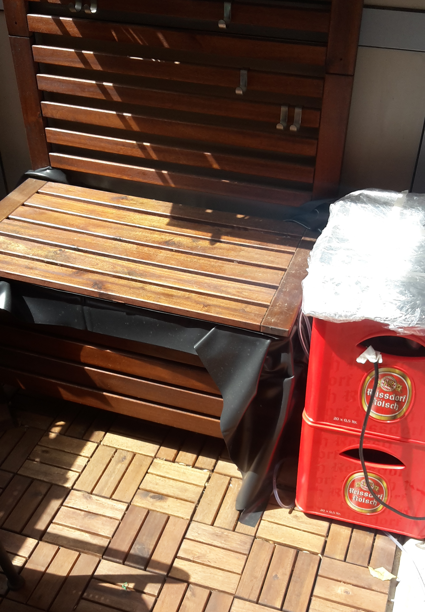

# balkonygardener

This is the software part of by balkony gardener hobby project.

I am a bad gardener, and a lazy one.
I have no clue when to water the plants and what else to do with them - I just
like to have them on my balkony growing and following the flow of time. 
Also, I like to travel on vacations so there're many days in a row where they would get
no water and just dry out.

So why not build some water pumping system that does the job for me?

## Just do it

* take a beer crate
* make some holes
* put a raspberry pi it
* connect a relais to the pi 
* connect a pump to the relais
* write some software for control  

So this project here is about controlling the **balkondy-gardener-machine**.

### Scheduled watering
Every evening it waters the plants, there some configurtion of how long which pump wil do the watering.

### Web interface  
There's a web-interface to trigger the tasks on demand.  
It also shows a list of time series data from sensors.

### Moisture Sensors (Arduino -> Pi)
I also connected an arduino with 4 moisture sensors to gather data, put it in sqlite db and display the data
in a graph. The idea was to trigger watering only if plants need water. Somehow those moisture sensors did
not work repliably.

### Ultrasonic sensor (Arduino -> Pi)
With arduino kits often comes an ultrasonic sensor that measures ditances.
I use this to measure the filling level of the water tank.

## Conclusion
This project worked out well in terms of watering and manual control via the webinterface.

### Raspberry Pi
Raspberry pi is very robust, in the first years during winter I put the whole crate inside.
The last year I left it outside, and it is still working.
  
### Sensoring
Sensoring part would need more attention.

### Arduino
Even if the sensors themselves did not work good, the arduino connected  
to the pi via usb putting data through a serial, connection worked very well.

